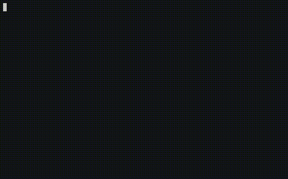

# Mentoring-SALACIA-team

The example code (and two videos) that I created for the SALACIA team
that I mentor in ESA - in the scope of the
[REXUS/BEXUS experiments](http://rexusbexus.net/) .

## Creating the daemon

## Installing the daemon

